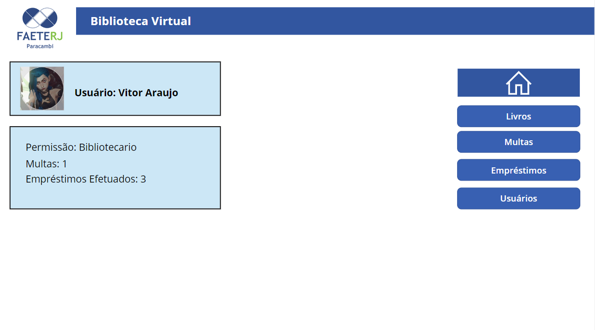

# Telas do Aplicativo

- Tela Principal
- Livros Disponíveis
- Multas
- Empréstimo (Bibliotecários)
- Usuários

## Tela Principal

- O aplicativo utilza o email do usuário logado no navegador como forma de validação, permitindo o acesso apenas caso esteja cadastrado.


### Codigo de Verificação

```
If(
    !IsBlank(LookUp(Usuários; Email = User().Email));
    If(
        LookUp(Usuários; Email = User().Email).Bloqueado = true;
        true;
        false
    );
    false
)


```

- Caso o usuário seja registrado e não tenha sido bloqueado devido a multas, a tela principal estará disponível



- Status

```
Permissão: " & First(Filter(Usuários; Email = User().Email)).

"Multas: " & Text(CountRows(Filter(Multa_1; Email = User().Email && Text(Status1)="Pendente")); "0")

"Empréstimos Efetuados: " & Text(CountRows(Filter(Livros; EmailPosse = User().Email && 'Emprestimo efetuado' = true)); "0")


```

## Livros Disponiveis

- Tela Responsável por mostrar todos os livros disponíveis na biblioteca, separando principalmente em Disponíveis e não disponiveis(inutilizados pelo bibliotecário ou já reservados)


- Ao Selecionar um livro , haverá a opção de pedir reserva para o bibliotecário(tornando indisponível), ou inutilizar o livro, sendo a última função visivel apenas para o bibliotecário.


#### Inutlizar

```
If(
    selectedItem.Disponivel = true;
    Patch(
        Livros;
        selectedItem;
        {
            Disponivel:false

        }
    );
    Notify("Livro não disponível."; NotificationType.Error)
)

```

#### Reservar

```
If(
    selectedItem.Disponivel = true;
    Patch(
        Livros;
        selectedItem;
        {
            'Aguardando Emprestimo': true;
            EmailPosse: User().Email
        }
    );
    Notify("Livro não disponível."; NotificationType.Error)
)

```

## Multa

- Esta tela consiste em mostrar ao usuário suas multas pendentes, notificando o valor e a data de emissão.


## Empréstimo

- A Tela responsável pela admnistração do fluxo de reservas, multas e registro de livros, sendo visível apenas para o bibliotecário,


- Nesta Tela ficam pendente os empréstimos aguardando validação do bibliotecário. Ao selecionar um pedido haverá diversas opções. Sendo elas :


- Emitir Multa: Envia uma multa para o usuário que Solicitou o Empréstimo , caso haja algum problema causado por ele.
- Negar Empréstimo: Ao negar o empréstimo, o livro se tornar disponível novamente para solicitar a reserva.
- Emprestar: Confirma o empréstimo do livro para o usuário.

## Empréstimo Efetuado

- A tela informa os livros que atualmente estão reservados. Ao selecionar o livro, terá as mesmas opções da tela anterior(Empréstimo Disponível).


## Lista de Multa dos Usuários

- A tela informa todas as multas dos usuários no sistema. Tendo opção de edita-las.


## Registrar Livros

- Tela Responsável por adicionar novos livros no sistema, sendo vísivel apenas ao bibliotecário.

  

## Usuários

- Tela do ADM, onde será possível editar cargos de usuários, criar novos e bloquear Usuários.

  
